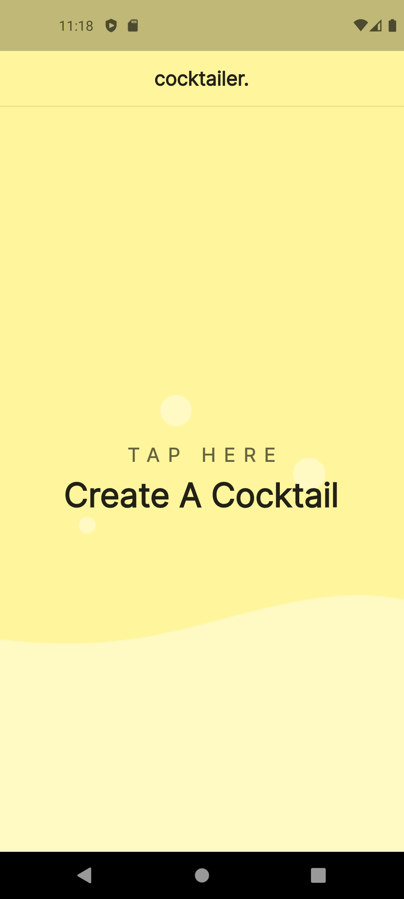

# Cocktailer - Flutter Application for Shape.

A cross-platform application that allows you to generate random cocktails from [CocktailDB](https://www.thecocktaildb.com/).

### Source Code Directories

Mock-up designs can be found in `mock_images/`.
All source code can be found within `lib/`.

### Assets

All images of cocktails & ingredients sourced from CocktailDB.
Wave .png generated from [getwaves.io](https://getwaves.io/).

### Screenshots

Landing screen/Homepage:

View randomly generated cocktail (view_cocktail) **(note the cocktail picture does not display properly in screenshot)**:

View more information for generated cocktail (view_recipe):

Designed & developed by Mushfikur Rahman.
